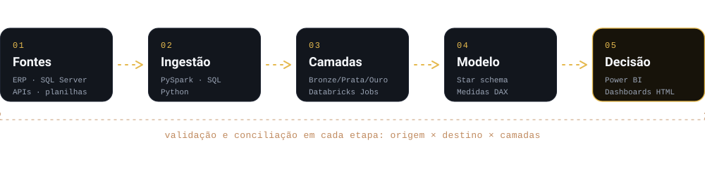
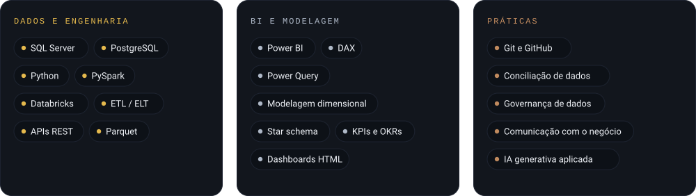

 

&nbsp;
&nbsp;

 

## Sobre

Sou analista de dados e BI em São Paulo, formado em Análise e Desenvolvimento de Sistemas pela SPTech. Trabalho no ciclo completo do dado, da ingestão em PySpark e SQL até o painel que uma área abre todos os dias.

Gosto de ficar entre duas metades que costumam andar separadas: a engenharia (pipelines, migrações, validação) e o negócio (qual decisão esse número precisa sustentar). Antes de desligar um sistema antigo, rodo os dois em paralelo e confiro até fechar.

Meu foco de crescimento é a **Engenharia de Dados**: pipelines em escala, orquestração e qualidade de dados.

English

 

I am a data and BI analyst based in São Paulo, Brazil, with a degree in Systems Analysis and Development. I work across the full data cycle, from PySpark and SQL ingestion to the dashboard a team opens every day, and I like sitting between engineering (pipelines, migrations, validation) and the business (which decision this number has to support). Before retiring a legacy system, I run both side by side until the numbers match. My growth focus is Data Engineering.

 

## Resultados em números

Números do meu trabalho profissional. Nenhum dado de cliente é publicado.

 

## Do dado bruto à decisão

 

## Stack

**Estudando agora:** orquestração com Airflow, transformação com dbt e um data lake local em Docker (MinIO, Spark e PostgreSQL).

 

## Projeto em destaque

<table>
<tr>
<td width="56%" valign="top">

</td>
<td valign="top">

### Loja Perfeita

Painel de execução em loja para trade marketing. Cada visita de campo vira uma nota de 0 a 10, composta por 5 pilares (sortimento, planograma, material de PDV, ponto extra e preço), com metas em semáforo e navegação da visão executiva até o SKU.

Modelo dimensional com 8 tabelas fato, 10 dimensões e 70+ medidas DAX.

Uma versão genérica, com dados 100% sintéticos, está sendo preparada para download.

`Power BI` `DAX` `Power Query` `Modelagem dimensional`

<a href="https://claude.ai/artifact/WoGMnjhwSAoJuStGMEWP81">Ver o caso completo no portfólio</a>

</td>
</tr>
</table>

 

## Trajetória

| Período | Papel | Entregas |
| :-- | :-- | :-- |
| 03/2026 a hoje | Analista de Dados e BI | Painel de execução em loja em Power BI com nota composta por 5 pilares. ETLs em SQL e Python para campanhas anuais com fechamentos bimestrais e trimestrais. Dashboards HTML alimentados por ETL próprio. |
| 08/2024 a 03/2026 | Analista de Dados, multinacional | Pipeline de comissionamento de mais de 30 canais B2B, de 4 a 6 horas para cerca de 10 minutos, agendado no Databricks Jobs. Migração do SQL Server on-premises para o Databricks (camada Ouro). Migração de painéis do QlikView para o Power BI, com validação em paralelo até a desativação do legado. |
| 2024 a 2026 | SPTech | Análise e Desenvolvimento de Sistemas, concluído em 2026. |

 

## Contato

- **Portfólio:** [claude.ai/artifact/WoGMnjhwSAoJuStGMEWP81](https://claude.ai/artifact/WoGMnjhwSAoJuStGMEWP81)
- **LinkedIn:** [linkedin.com/in/alejandrocastor-6a4311254](https://www.linkedin.com/in/alejandrocastor-6a4311254)
- **E-mail:** [alejandrocastorfadim@gmail.com](mailto:alejandrocastorfadim@gmail.com)

